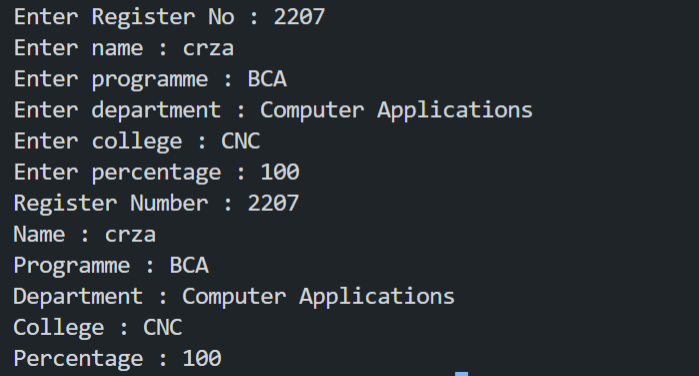

# 3 Write a program to read and display the reg no , name , programme , department , name of college and percentage of student using class.

### Compile

```sh
    g++ main.cpp -o "main"
```

### Execute

```sh
   ./main
```
### Output

