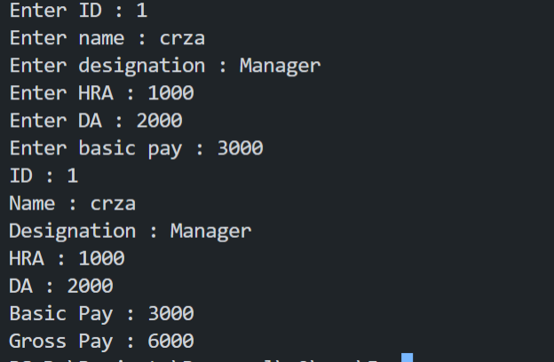

# 5 Write a program with class Employee which has ID , Name , Designation , HRA , DA , Basic Pay and a method to calculate the Gross Pay.

### Compile

```sh
    g++ main.cpp -o "main"
```

### Execute

```sh
   ./main
```
### Output

